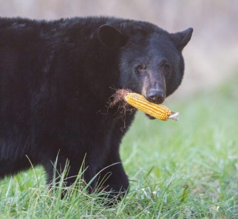

Image source: [Bears Chow Down on $20,000 Worth of Maryland Corn](https://baltimorefishbowl.com/stories/bears-chow-20000-worth-maryland-corn/)

*A bear is harvesting corn. He gets one ear of corn, holds it with his left armpit. Then he reaches out to another ear of corn with his left paw, holds it with his right armpit. Then raising his right paw for another...At the end of the day, how many pieces of corn does he have?*

- Yumi's motion planning playground!
- Setup: Ubuntu 20.04 with ROS Noetic.
- Use the repo [https://github.com/zhyma/yumi](https://github.com/zhyma/yumi) to set up the environment.
	Setup the RWS on the Yumi side.
- <s>Need to install TRAC_IK (`sudo apt-get install ros-noetic-trac-ik`)</s>
- <s>Need to install transforms3d (`pip3 install transforms3d`)</s>

## Motion planning test
- Run the RWS RAPID script on the Yumi side.
- Run Rviz+MoveIt to setup the connection with the robot:
	`roslaunch yumi_moveit_config rws_online.launch`
- Run `python3 main.py`